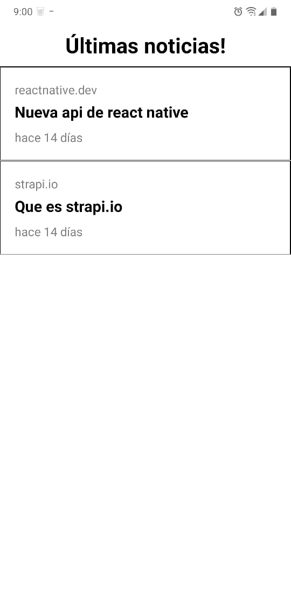
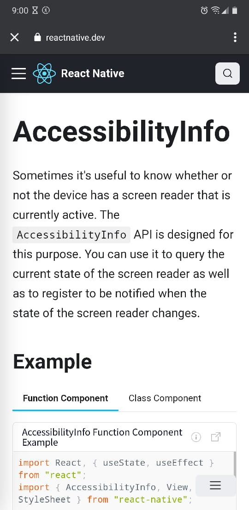

# App de news en tiempo real!

### Este es un proyecto de ejemplo utilizando principios básicos de desarrollo móvil con expo y elementos de react-native
### Configuracion: 
  - backend: strapi 👍
  - webView: expo-web-browser

Snaps:

1. Home:

2. New in web view:

E.O
